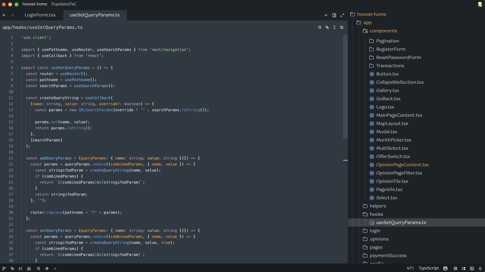

# supertheme4

A dark theme for ZED editor inspired by [Sublime Text's Marina](https://github.com/hnatiukr/zed-mariana-theme/) theme, specifically designed for web development.

## Overview

**supertheme4** brings the elegant aesthetics of Sublime Marina to ZED editor with a carefully crafted dark color palette. This theme features sophisticated blue-grey backgrounds with vibrant accent colors that provide excellent contrast and readability for modern web development.

## Features

- 🌊 **Marina-inspired design** - Captures the essence of Sublime Text's beloved Marina theme
- 💻 **Web dev optimized** - Tailored syntax highlighting for HTML, CSS, JavaScript, and modern web frameworks
- 👁️ **Eye-friendly** - Carefully balanced colors reduce strain during extended coding sessions
- 🎨 **Rich syntax highlighting** - Distinct colors for different code elements with excellent contrast
- 🌙 **Dark theme** - Perfect for low-light environments and late-night coding

## Color Palette

The theme features a sophisticated color scheme with:

- **Background**: Deep blue-grey (`#2e3842`)
- **Syntax colors**: Soft blues, greens, purples, and warm oranges
- **Accent colors**: Carefully chosen for maximum readability and visual appeal

## Installation

1. Open ZED editor
2. Go to Extensions
3. Search for "supertheme4"
4. Click Install
5. Go to Settings → Theme and select "supertheme4"

### Manual Installation

1. Clone this repository
2. Copy the extension to your ZED extensions directory
3. Restart ZED
4. Select the theme in Settings → Theme

## Screenshots

_supertheme4 theme showcasing syntax highlighting for web development_

## Contributing

Contributions are welcome! Feel free to:

- Report issues
- Suggest improvements
- Submit pull requests

## Repository

[GitHub Repository](https://github.com/superkacper4/supertheme4)

## Author

Created by **superkacper4** ([kucza06@wp.pl](mailto:kucza06@wp.pl))

## License

This project is open source. Check the license file for details.

---

_Inspired by Sublime Text's Marina theme • Made with ❤️ for the ZED community_
